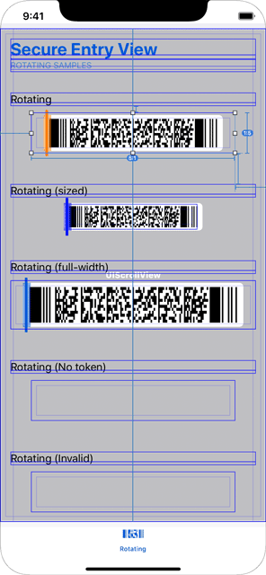
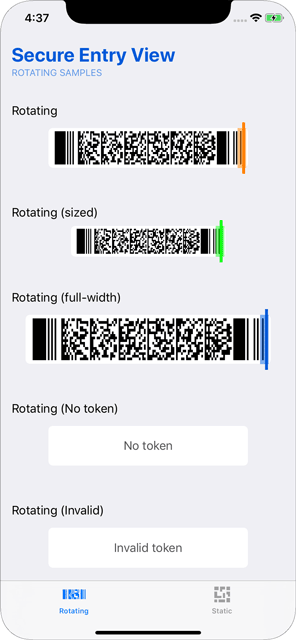

## Introduction

### SecureEntryView

The main view integrating the PDF417 into 3rd party applications is the `SecureEntryView`. It inherits from `UIView` and gives access to methods for controlling the underlying data and animation color.

Class definition for the view:

```swift
/**
* View displaying a rotating PDF417 or static PDF417 ticket.
*/
public final class SecureEntryView: UIView {}
```

## Installation

#### Cocoapods

1. Add the following to your PodFile
```
pod 'iOS-SecureEntrySDK', :git => 'https://github.com/ticketmaster/iOS-SecureEntrySDK.git'
```

2. Then run:
```
pod install
-- or --
pod update
```

#### Manually

1. Clone SecureEntrySDK from the git repository: https://github.com/ticketmaster/iOS-SecureEntrySDK
```
git clone https://github.com/ticketmaster/iOS-SecureEntrySDK
```

2. Add the `SecureEntryView.xcodeproj` from the cloned repository in your own Xcode project.
3. Link `Presence.framework` with your target
4. Add Copy Files Build Phase to include the framework to your application bundle

## Usage

| Storyboard Example | Result |
|:-------------:|:-----:|
|  |  |

### Adding the view

Simply include a UIView within your storyboard, and override it's class type to `SecureEntryView`, and link it to your code using an outlet:

```swift
@IBOutlet weak var secureEntryView: Presence.SecureEntryView!
```

or you may add it to a ViewController programmatically:

```swift
import Presence

...

var secureEntryView = Presence.SecureEntryView(frame: frameRect)
addSubview(secureEntryView)
```

---

### Position and size

The size of the rendered PDF417 displayed within the `SecureEntryView` is determined by the *width* of the view, however the height will be fixed at an aspect of 5:1, so to avoid any unexpected cropping or overlap with other elements, you should set the size, position, and aspect ratio of your `SecureEntryView` accordingly.

Since the `SecureEntryView` inherits from a standard `UIView`, you may use any methods associated with a view to alter its appearance, such as `setFrame`, etc.

---

### Syncing the time

#### `static func syncTime(force: Bool = false, completion: ((_ synced: Bool) -> Void)? = nil)`

This method is used to begin a background time sync. This method is provided to allow apps to initiate a time sync before a `SecureEntryView` is ever instantiated/displayed.

Perform a fresh time sync as close to app launch as possible.

Perform a fresh time sync prior to rendering SecureEntryView. If multiple are shown at the same time, such as in a collection or scroll view, this only needs to be done once for that container view; not each SecureEntryView instance.

**Note:** This is a static/singleton method, and must be called on the SecureEntryView class, and not a class instance.

```swift
// Initiates a background time sync 
SecureEntryView.syncTime(force: true)
```

---

### Applying the token

#### `var token: String?`

This property is used to apply a ticket's 'secure token' to the view. This will trigger a re-render of the view using the new token's data.

**Note:** You must set this value otherwise the view will show loading animation.

```swift
// set the token on the view 
secureEntryView.token = theNewToken
```
---

### Change the branding color

#### `var brandingColor: UIColor = .blue`

Sets the branding color to the specified color value. This color is typically associated with a particular brand or team. Currently the branding color affects only the animation.

```swift
secureEntryView.brandingColor = theBrandingColor
```

##### Parameters
- **color** _(UIColor)_: A color value to apply to the view.

---

### Change the branding color

#### `var pdf417Subtitle: String = "Screenshots are not accepted for entry"`

Creates a custom subtitle for the pdf417 variant of the SafeTix ticket. Will truncate if longer than the frame. Note: If set to "", the barcode subtitle will be hidden.

```swift
secureEntryView.pdf417Subtitle = theSubtitleText
```

##### Parameters
- **subtitleText** _(String)_: The text that will be displayed below the PDF417 barcode.

#### `var qrSubtitle: String = "Screenshots are not accepted for entry"`

Creates a custom subtitle for the qr variant of the SafeTix ticket. Will truncate if longer than the frame. Note: If set to "", the barcode subtitle will be hidden.

```swift
secureEntryView.qrSubtitle = theSubtitleText
```

##### Parameters
- **subtitleText** _(String)_: The text that will be displayed below the QR barcode.

#### `var isSubtitleBrandingEnabled: Bool = false`

If set to `true` the subtitles will use the branding color instead of the default black color.

```swift
secureEntryView.isSubtitleBrandingEnabled = true
```

## Acknowledgements

SecureEntrySDK depends on the following open-source projects:

- **Kronos** by lyft (https://github.com/lyft/Kronos)
- **SwiftOTP** by Lachlan Bell (https://github.com/lachlanbell/SwiftOTP)
- **CryptoSwift** by Marcin Krzyzanowski (https://github.com/krzyzanowskim/CryptoSwift)
- **KeychainAccess** by Kishikawa Katsumi (https://github.com/kishikawakatsumi/KeychainAccess)
- **SwiftGif** by Arne Bahlo (https://github.com/swiftgif/SwiftGif)

This product includes software developed by "Marcin Krzyzanowski" (http://krzyzanowskim.com/).
